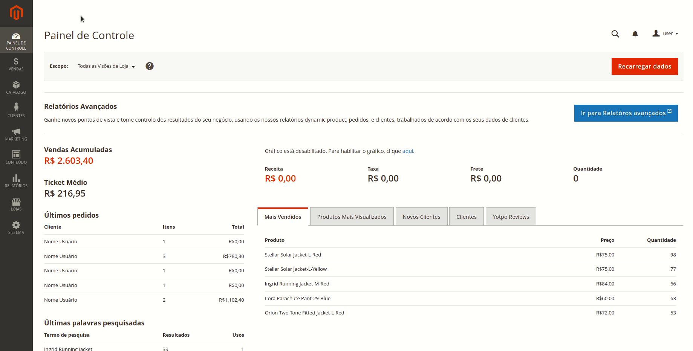
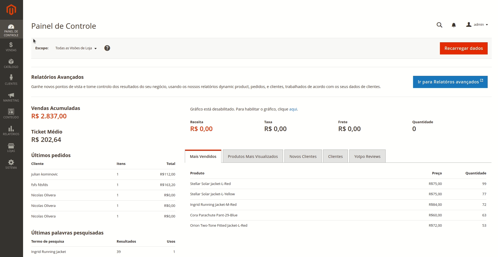
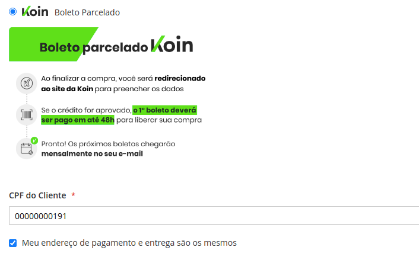
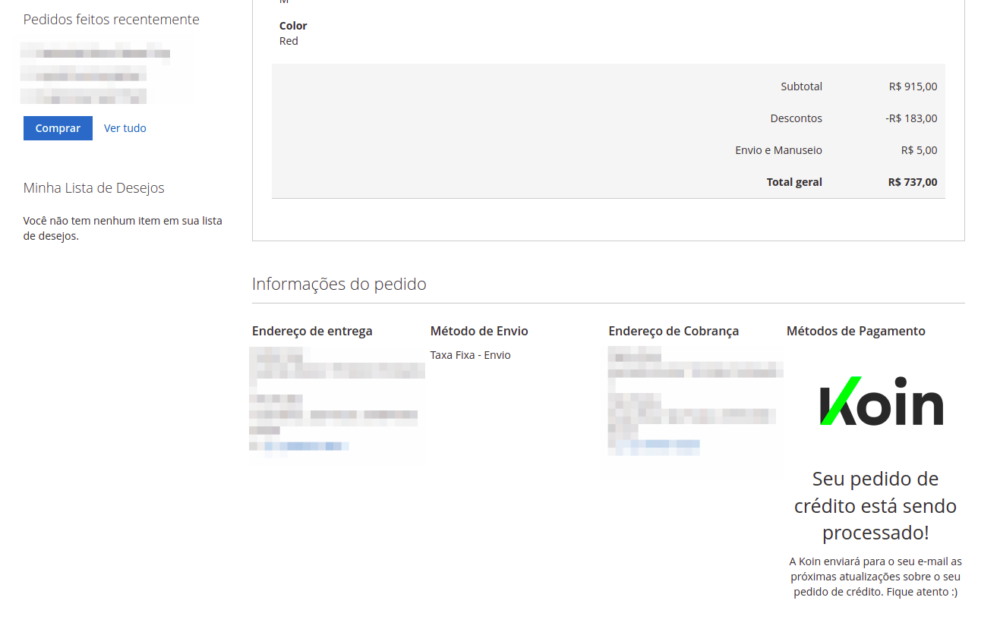
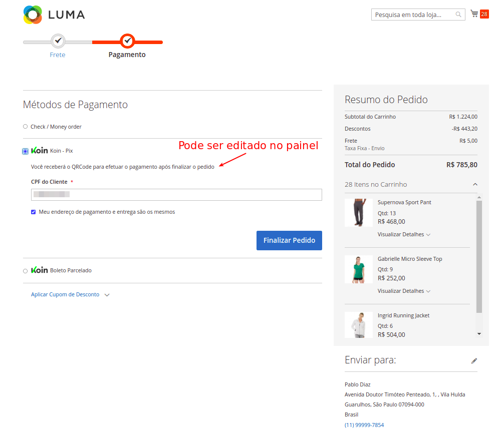
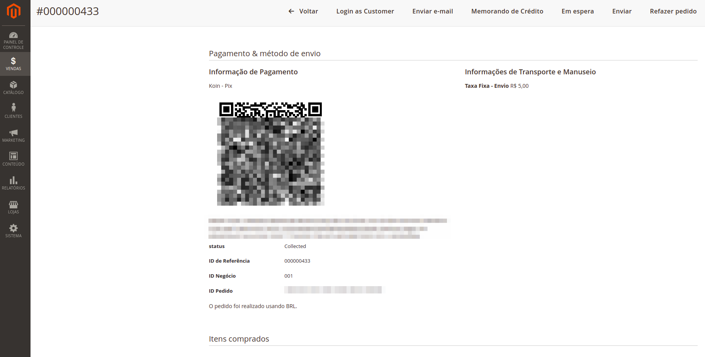
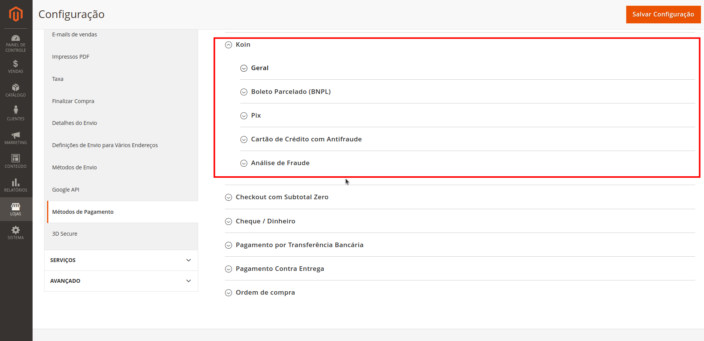

# Koin Payment / AntiFraud - Adobe Commerce 

**Composer**

```
composer config repositories.koinlatam-magento git https://github.com/koinlatam/magento2.git
composer require koin/payment

php bin/magento setup:upgrade
php bin/magento setup:di:compile
php bin/magento setup:static-content:deploy pt_BR en_US
```

**Instalação Manual**

Essa primeira etapa faça apenas se seu Magento não tem o Laminas (versões menores que o 2.3.5)  
1- Caso seu magento não tenha o Laminas, instale a dependência 

```
composer require laminas/laminas-http:>2.4.0 
composer require firebase/php-jwt:* 
composer require bacon/bacon-qr-code:* 
```
g
2 - Download o arquivo e coloque na pasta
```
git clone https://github.com/koinlatam/magento2.git.git app/code/Koin/Payment
```

3 - Depois rodar os comandos de instalação

```
php bin/magento setup:upgrade
php bin/magento setup:di:compile
php bin/magento setup:static-content:deploy pt_BR en_US
```

## Desinstalar

1 - Remova o módulo, isso dependerá da forma como foi instalado

**Composer**  

Rode o comando de remoção via composer:  
```
composer remove koin/payment
```

**Manual**  

Remova a pasta:  
```
app/code/Koin/Payment
```

2 - Rode os comandos de atualização

```
php bin/magento setup:upgrade
php bin/magento setup:di:compile
php bin/magento setup:static-content:deploy pt_BR en_US
```


## Descrição
Módulo disponível em português e inglês, compatível com a versão 2.4 do Adobe Commerce.
O módulo utiliza a API da KOIN para a geração de pagamentos com:  
- Boleto Parcelado para pessoas físicas  
- PIX  
- Cartão de Crédito com Antifraude

O módulo também consta com o antifraude da Koin, onde é possível enviar os pedidos para análise de fraude

## Funcionalidades

### Pagamento com Boleto Parcelado
No fluxo de boleto parcelado, o consumidor é direcionado para o ambiente da Koin 
onde poderá escolher quantas parcelas deseja pagar verifica o juro e finaliza o pedido.  
Após finalizar ele é redirecionado de volta pra loja que recebe as informações dessa escolha via callback  
Em resumo, as funcionalidades são:  
- Redirect 
- Fatura automática quando o pagamento é efeturado e aprovado
- Atualização de status do pedido utilizando callback

### Pagamento com Pix
Ao finalizar os pedidos com Pix, será gerado um QRCode para o consumidor pagar a compra,
assim que o pagamento for aprovado é atualizado via callback, sendo possível também estornar o Pix  
Em resumo, as funcionalidades são:
- Geração do Pix na finalização da compra
- Fatura automática via callback quando o pagamento é aprovado
- Atualização de status do pedido utilizando callback
- Estorno pelo painel (Reembolso Online através de memorando de crédito da fatura) 

### Pagamento com Cartão de Crédito
Finalização Transparente, o consumidor finaliza o pedido na loja, sem redirecionamento  
Em resumo, as funcionalidades são:
- Fatura automática via callback quando o pagamento é aprovado
- Atualização de status do pedido utilizando callback
- Estorno pelo painel (Reembolso Online através de memorando de crédito da fatura) 

###  Antifraude
- Escolher quais métodos de pagamento irão para análise antifraude
- Escolher quais status de pedido irão para antifraude
- Atualização de antifraude do pedido utilizando callback
- Visualização do Status Antifraude na página do pedido
- Envio via cron dos pedidos para análise antifraude

#### Fluxo antifraude
Para funcionar antifraude, deverá escolher quais métodos e status devem ser enviados para análise de fraude, após escolher
na atualização dos pedidos, esses pedidos são enviados para uma fila e então enviados à análise de fraude.  
Após a análise feita, a mesma será atualizada via webhook, é possível escolher quais status de pedidos deseja
para pedidos aprovados ou reprovados pela análise antifraude, é possível também cancelar pedidos reprovados pela análise de fraude,
nesse caso, se o método de pagamento implementar o estorno ou a liberação do cartão online, será feito, ou seja,
será feito o cancelamento ou criado o memorando de crédito online (depende de funcionalidade implementada no método de pagamento)


#### Origem dados antifraude  
No caso de um método de pagamento com cartão de crédito, o módulo usará os dados dos campos de pagamento padrões do magento
> cc_owner, cc_type, cc_last_4, cc_exp_month, cc_exp_year

Caso o cc_bin seja gravado nas informações adicionais como cc_bin, será enviado também  
O parcelamento pode ser adicionado da seguinte forma:  
> - Informações adicionais do pagamento (additinal_information) installments, cc_installments, installment_quantity (PagSeguro Ricardo Martins), term (PayPalBR)  
> - Serializado no Additional Data como installments, cc_installments

Informações do documento nacional de identificação (DNI) são pegas do taxvat

Dados de endereço serão dados de endereço de entrega e cobrança do pedido.

## Configurações  

### Geral
- **Credenciais Globais e Configurações Gerais**  
  Configurações de Logs e informações do pedido na página de sucesso (se o tema não tiver isso, é útil pois o consumidor poderá ver os dados do pedido já na tela de sucesso)


- **Credenciais do Boleto Parcelado**  
Dados e credenciais para utilização do Boleto Parcelado


- **Credenciais de Pagamentos (Pix / Antifraude)**  
  Dados e credenciais para utilização da solução de Pagamentos com Pix, são serviçoes diferentes e usam credenciais direfentes


- **Atributos de Endereço**  
Dados relativos aos endereços da loja referete à correspondência das linha do endereço no Magento 


- **Atributos de Cliente**  
Dados relativos aos campos de endereço de pessoas jurídicas


### Boleto Parcelado  
  Configurações gerias referentes ao método de Pagamento de Boleto Parcelado:
- Status de Pedidos para cada opção
- Mensagem na tela de checkout
- Mensagem na tela de sucesso
- Mensagem para cada etapa do processo de aprovação

### Pix
Configurações gerais referentes ao Método de Pagamento de Pix:
- Status de Pedidos para cada opção
- Mensagem na tela de checkout
- Mensagem na tela de sucesso
- Valor Mínimo
- Valor Máximo

### Cartão de Crédito com Antifraude
Configurações gerais referentes ao Método de Pagamento com Cartão de Crédito:
- Status de Pedidos para cada opção
- Bandeiras de Cartão aceitas
- Parcelamento
- Juros
- Valor Mínimo
- Valor Máximo

### Antifraude
Configurações gerais referentes à Antifraude:
- Métodos de Pagamento
- Status de Pedidos
- Cancelar Pedidos Negados
- Status de Pedidos Negados
- Alterar Status de Pedidos Aprovados
- Status de Pedidos Aprovados
- Valor Mínimo

## Callbacks
- No painel da loja, em **Vendas > Koin > Callbacks**, é possível visualizar o payload de callback retornado para Koin.  
    
  


- Assim como ao acesar o pedido, você poderá verificar os dados e também todas as notificações referentes ao pedido.  
    
  


- Assim como ao acesar o pedido, você poderá verificar os dados e também todas as notificações referentes ao pedido.  
    
  

## Antifraude
- No painel da loja, em **Vendas > Koin > Análise de Fraude**, é possível visualizar o todos os pedidos enviados para Antifraude.  
    
  

- Assim como ao acesar o pedido, você poderá verificar os dados da análise  
  


## Exemplos  
### Boleto Parcelado




### PIX  
  
  


### Configurações
  


### Changelog
v2.5.0:
- feat: added tarjeta naranja to credit card list

v2.5.1:
- feat: added version to header requests
- feat: added module version to system configuration

v2.5.2:
- fix: saving cc_number masked to additional information 

v2.5.3: 
- fix: array first included only in deve dependency, change to the class

v2.5.4:
- feat: remove from validation tarjeta naranja

v2.5.5:
- Fix error in general settings

v2.5.6:
- Change shipping delivery node for BNPL
- Change tokenize route
- Change payments routes from payments/v1 to v1/payments
- Change antifraud routes from antifraud/v1 to v1/antifraud

v2.5.7:
- Fix error when the refund didn't return JSON response

v2.5.8:
- Fix: 'Opened' transactions with 'Failed' Callback was remaining pending
- Fiz: 'Opened' transactions with 'Capture' Callback wasn't creating the invoice automatically
- Feat: Button to fetch info when order is Opened

v2.5.9:
- Fix: Sandbox for tokenize

v2.6.0
- Feat: Added new options for installment rules to show only the text or the text with the installments
- Feat: Possibility to show more than one installment rules with the same installment number
- Fix: fallback to use payments URL for tokenize
- Fix: error when creating a refund that was dispatching an error even when the refund was successful

v2.6.1
- Feat: Save Refund request and response when order transaction rollbacks
- Feat: add specific user agent for sandbox transactions

v2.6.2
- Feat: Use default private key async requests

v2.6.3
- Fix: Use hash to async requests

v2.6.4
- Fix: using wrong hash when multi store

v2.6.5
- Feat: allow fetch info for authorized orders
